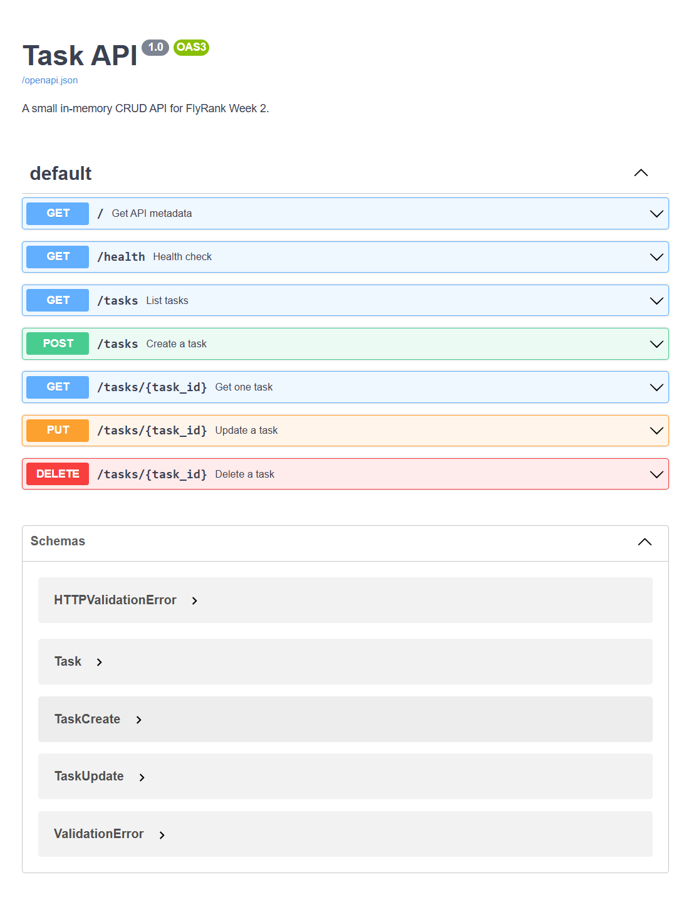
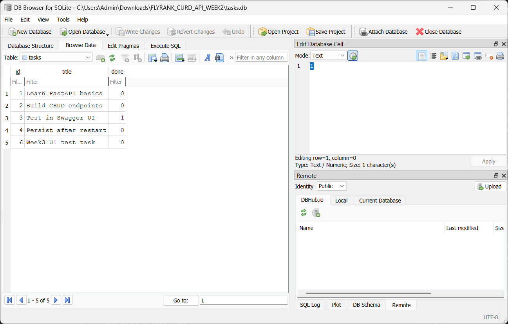

# Task API

This is a small FastAPI CRUD API for the FlyRank Week 3 assignment. It stores tasks in SQLite so data survives server restarts, while keeping the same API endpoints from Week 2.

## Setup

1. Create and activate a virtual environment on Windows:
   - `python -m venv .venv`
   - `.venv\\Scripts\\activate`
2. Install dependencies:
   - `pip install -r requirements.txt`

## Run

```bash
uvicorn app.main:app --reload --port 8000
```

## Why SQLite

SQLite was chosen because it is a single-file database with zero separate server setup. It creates `tasks.db` automatically on first run and keeps task data after the API restarts.

## Database file

- Database path: `tasks.db` in the project root
- The file is created automatically when the app starts
- `tasks.db` is git-ignored so each fresh clone starts with a clean database that seeds itself

## Endpoints

| Method | Path | Description | Success Code |
| --- | --- | --- | --- |
| GET | `/` | API metadata | 200 |
| GET | `/health` | Health check | 200 |
| GET | `/tasks` | List all tasks | 200 |
| GET | `/tasks/{task_id}` | Get one task | 200 |
| POST | `/tasks` | Create a task | 201 |
| PUT | `/tasks/{task_id}` | Update a task | 200 |
| DELETE | `/tasks/{task_id}` | Delete a task | 204 |

## Sample `curl -i`

```bash
curl -i -X POST http://localhost:8000/tasks -H "Content-Type: application/json" -d "{\"title\":\"Buy milk\"}"
```

Expected response:

```text
HTTP/1.1 201 Created
content-type: application/json

{"id":4,"title":"Buy milk","done":false}
```

## Swagger UI

Open `http://localhost:8000/docs` to try the full CRUD flow.



## SQLite verification

Example SQL query used in Stage 4:

```sql
SELECT COUNT(*) FROM tasks;
```

This query returns the total number of rows currently stored in the `tasks` table.

## DB Browser screenshot



## Notes

- Data is stored in `tasks.db`, so it survives server restarts.
- POST and PUT validate input and return JSON errors for bad requests.
- Unknown task IDs return 404 with a JSON error message.
- The same CRUD endpoint tests from Week 2 still pass, which shows the API contract stayed the same while only the storage layer changed.

## AI vs Me

To be completed in Stage 7 after running a separate AI-generated version in quarantine.
